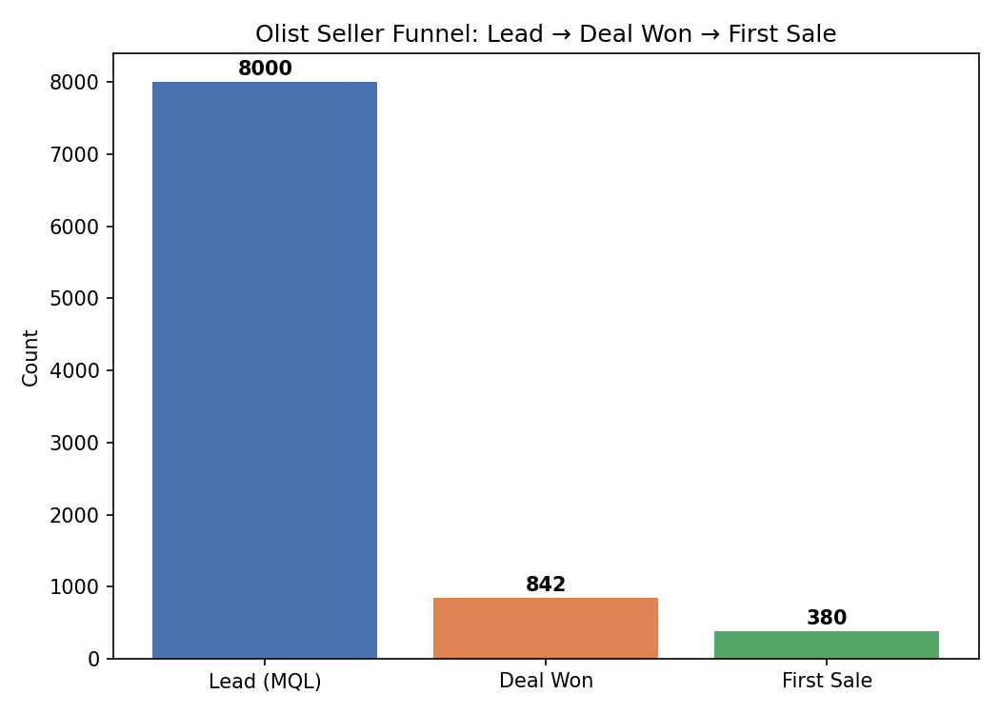
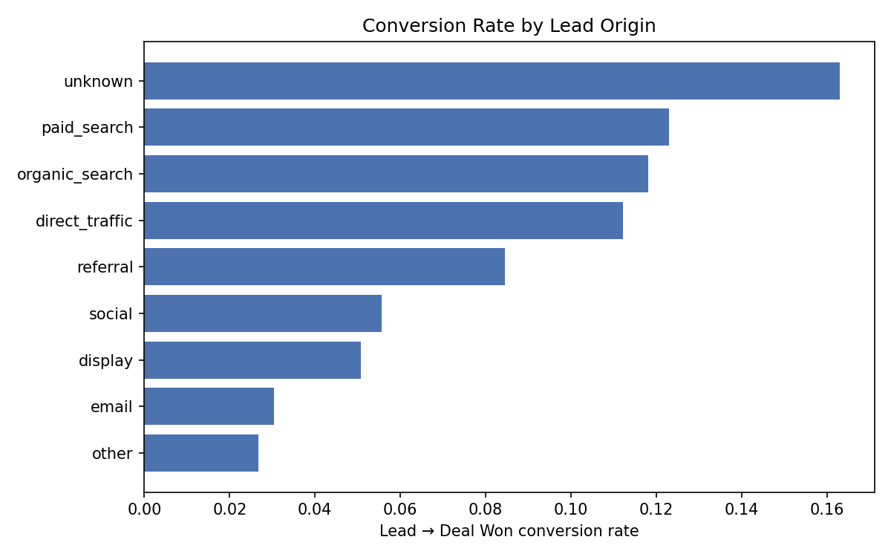
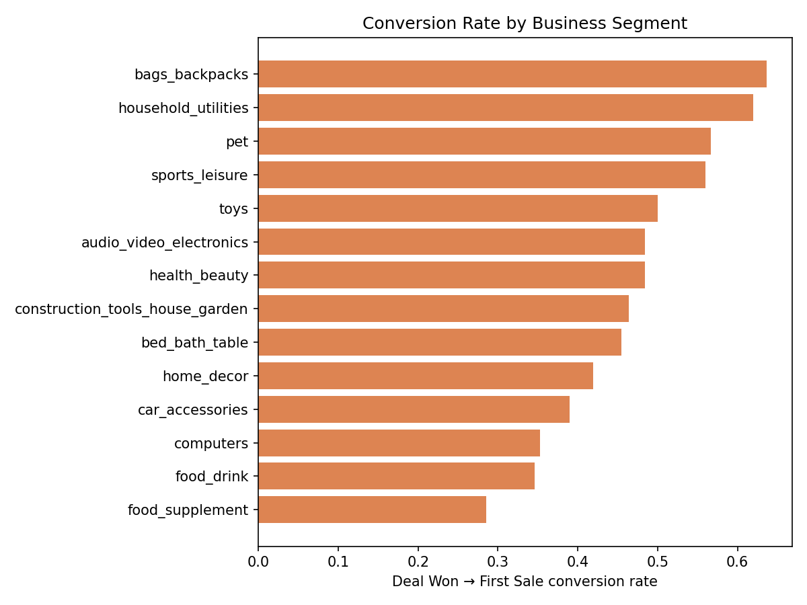

# Olist Seller Acquisition Funnel Analysis

A funnel analysis of how marketing leads convert into active, selling merchants
on Olist, a Brazilian e-commerce marketplace. Built with SQL (SQLite) and
Python (pandas, matplotlib).

## Business question

Olist's marketing team generates leads (potential sellers) and passes them to
a sales team to close as onboarded merchants. Not every signed merchant goes
on to actually sell anything. This project traces the full funnel:

**Lead generated → Deal won (seller signed) → First sale made**

and asks: where is the funnel actually leaking, and does that differ by
acquisition channel or product category?

## Data

Two public datasets from Olist, joined on `mql_id` / `seller_id`:

- [Brazilian E-Commerce Public Dataset by Olist](https://www.kaggle.com/datasets/olistbr/brazilian-ecommerce) — orders, order items, sellers
- [Marketing Funnel by Olist](https://www.kaggle.com/datasets/olistbr/marketing-funnel-olist) — leads and closed deals

Download both, unzip, and place the CSVs in `data/` before running the
scripts (not committed to this repo due to size).

## Findings

### 1. Overall funnel

| Stage | Count | % of leads |
|---|---|---|
| Lead (MQL) | 8,000 | 100% |
| Deal Won | 842 | 10.5% |
| First Sale | 380 | 4.75% |



The biggest single drop is lead → deal (nearly 90% of leads never convert),
but the more actionable gap is the **462 sellers who signed and never sold
anything** — 55% of onboarded sellers. That's a retention/onboarding problem,
not an acquisition problem.

### 2. Conversion by lead origin



Leads from `unknown`-tagged sources, paid search, and organic search convert
at 11.8–16.3%. Email (3.0%) and "other" (2.7%) are the weakest channels —
worth flagging to a marketing team as candidates to deprioritise or fix.

### 3. Conversion by business segment (deal → first sale)



Sellers in `bags_backpacks`, `household_utilities`, and `pet` categories
convert from signed to selling at 57–64%, versus `food_supplement` and
`computers` at 29–35%. This suggests onboarding support could usefully be
prioritised by category rather than applied uniformly.

## How to reproduce

```bash
pip install pandas matplotlib
python python/build_database.py   # builds olist_funnel.db from data/*.csv
python python/analysis.py         # runs the funnel queries, saves charts/
```

The raw SQL is also in `sql/funnel_queries.sql` if you want to run it
directly against the SQLite database with any SQL client.

## Tech stack

Python, pandas, SQLite/SQL, matplotlib
